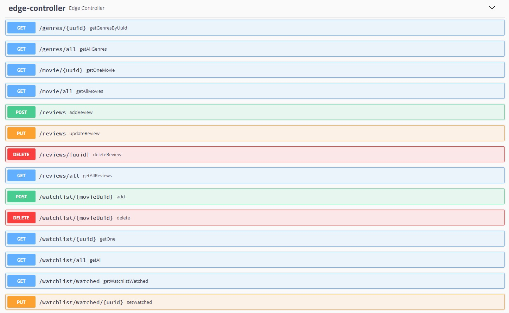

# edge_ms 
## Testen

[_Edge service_]  

[_Watchlist microservice_](https://github.com/TomBsmns/watchlist_ms)  

[_Review microservice_](https://github.com/vanhouttejan4/review_ms)  

[_Movie microservice_](https://github.com/TomBsmns/movie-ms)  

[_Genres microservice_](https://github.com/tomasmarlein/genres_ms)  

## Swagger

